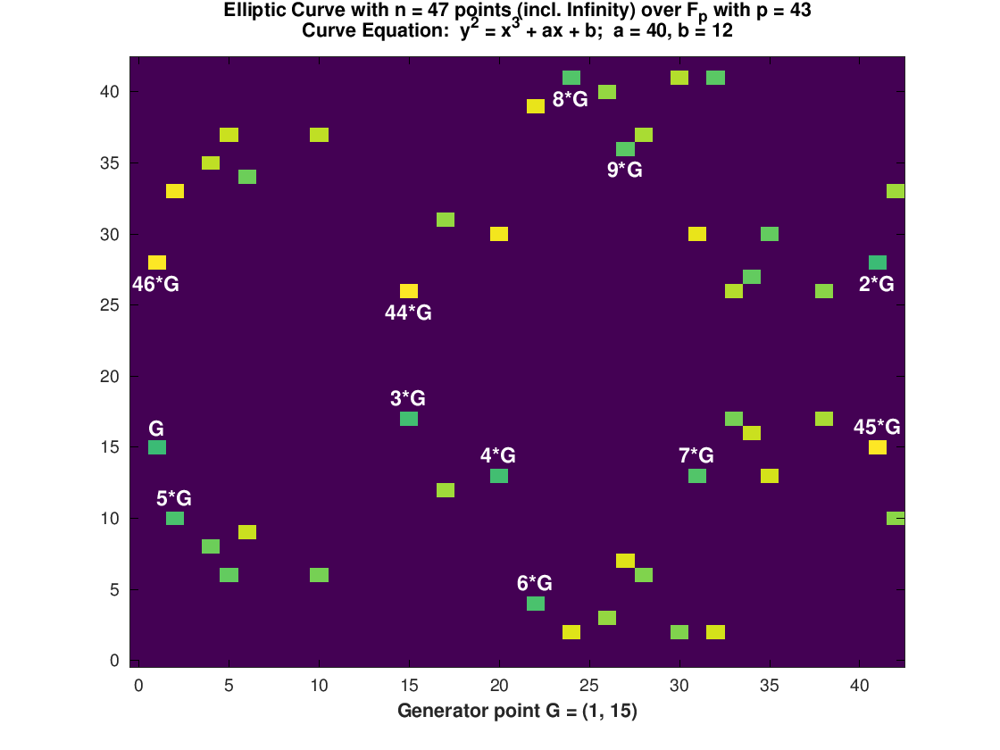

## Tinkerings with Elliptic Curves

Nothing truly new here - there are plenty of example elliptic curve plots on the internet, but
as with so many things, learning comes by doing, not by looking at other people's examples, so
here is one more.

## Purpose

Several:

1) To find a _small_ prime-order curve group to serve as an example for understanding _large_
groups that are hard to imagine (like secp256k1, the group used to provide cryptographic
security to Bitcoin and many other cryptos).

2) To understand the difference between _field order_ (_p_), and _group order_ (_n_).

3) Develop some intuition as to what happens if _p_ or _n_ are not prime.

4) Resolve a vexxing conundrum to me: _Why_ is the curve order not simply twice the field order?

As it turns out, the answer to (4) is actually quite simple.  The source of confusion to me was
the assumption that every _x_ coordinate should have two solutions.  From the curve equation:

_y2 = x3 + a*x + b_

One would naturally expect two solutions for every x.  But while the _y2_ would
naturally _imply_ two solutions, it does not necessarily guarantee the _existence_ of those two
solutions.  So, simply put, it turns out that for some _x_ there are no solutions, and therefore
the group order _n_ and the field order _p_ are not required to have a fixed relationship.  (In
fact, in certain cases, non-prime _p_ for example, the square root can have _more_ than 2
solutions. Example: in mod 15, _y2 = 4_ has four solutions: _y = 2, 7, 8,_ and _13_.)

## Example curves

A nice prime-field (p=43) prime-order group (n=47) showing 46 points (the "point at infinity" is
the 47th) with selected multiples of the chosen generator labeled.  Easy to see that some x
coordinates have no solution, but more than half do, so the group order is greater than the
field order.

## Source code

The code is written in GNU Octave but should, with minimal modifications, run in MATLAB.
